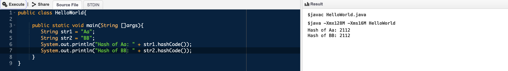
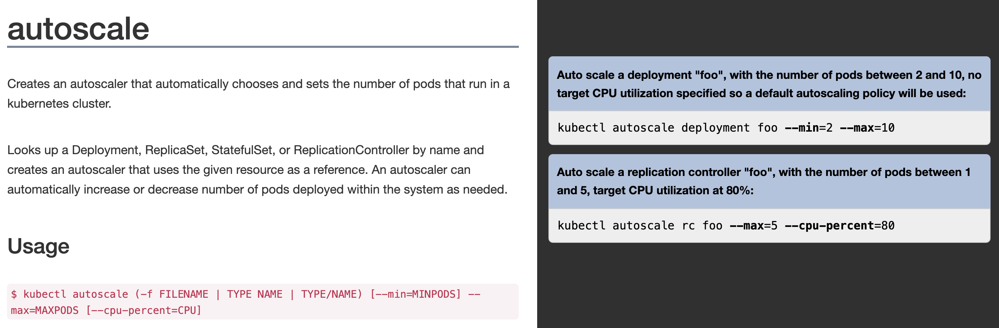

# tiny_url_design

## Problem statement
Given a URL to shorten, it gives back a unique shortened URL
Given a URL to shorten and a custom string, it gives back a shortened URL with the custom string as suffix (If its available).
When I type shortened URL into the browser, it redirects me to the original URL.

## High level approach
For a given URL, the idea is to generate a unique fixed length key and save it into DB as a key value.

For example, following would be rough schema to save the data.

id | url | unique_key | custom_string

- id = auto generated primary key
- url = actual url provided by the user
- unique_key = Unique key generated against a specific URL.
- custom_string = Optional field, provided by the user. If provided, it should be appended to the unique key.

When someone requests http://<<domain_url_shortner>>/unique_key (or http://<<domain_url_shortner>>/unique_keyCustomString)
Pick the last part of the URL and extract first 7 characters (considering fixed legth unique key). Make a query to DB such that these characters match unique_key 
in database and get the corresponding actual URL and redirect to that url.

## How does your system ensure that 2 URLs never map to the same shortened URL?
In this section, we will discuss how can we make sure that no 2 url's get the same unique key.
We have multiple approaches here, lets discuss pros and cons of this approach.

### Hashing a URL
One of the easiest approach would be to create a hash of a given URL. Meaning, f(url) = 'a_supposedly_unique_key'.
And this unique string then can be saved and returned as a part of URL.

Let's discuss problems in this approach.
#### Hashcode really unique?
If we talk about java's hashcode function of String class, it will generate duplicate hashcode.
For example look at the following code.

#### Fixed length
If we rely on in-built function of String class then it would not be able provide us with fixed length hashcode.

### Other approaches
We can use UUID which can generate global unique id, across different machines. But this id is 128 bit long (quite a paradox for url shortner solution :D) and does not index well in DB.

Another approach would be to generate 12-byte (96-bit) hexadecimal numbers that are made up of (MongoDB ObjectID) -
a 4-byte epoch timestamp in seconds,
a 3-byte machine identifier,
a 2-byte process id, and
a 3-byte counter, starting with a random value.
This is smaller than the earlier 128-bit UUID but again size is relatively longer.

### Relying on DB id
Well, if returning url with id is acceptable then we can rely on DB to generate an auto-increment unique id and create url with it. Meaning, insert actual url in DB. This will return us an id from DB. Use this id to append to an url. Like this http://<some_domain>/12324.
When we receive this url, we extract id and reach out to be get the corresponding url and redirect.
One thing we need to see is can we make this id fixed length. If not then 'custom string' scenario will not be satisfied.

## How will you ensure the system is very low latency?
The algorithm mentioned above is indeed low latency because all we are doing is pefroming a lookup on unique string. We can index this column so that lookup becomes even faster. The overall operation does not do any heavylifting except making a query to DB. To improve on this, we can make use of in memory db like Redis which can store recently used unique string and it's correspoding urls. This will overal reduce the time for frequently accessed urls.

## What will happen if the machine storing the URL mapping dies? (Power outage / Hard Disk gone bad)
This can definitely be handled with more replicas. If we consider cloud architecture then it becomes easy to manage number of machine handling load.

## How do you make sure your system is consistent? This is to say, if I have shortened a URL, given the shortened URL, my system should always return the original URL no matter when I call your system.
I'd like to kubernetes autoscale approach to manage the scaling for me. This way I don't have to manage machines manually, I can specify the load threshold and decide the maximum pods that can be generated when there is peak load. Also, this will also be cost effective solution since number of pods will come down as the load decreases.
Please see the image below.

## How do you make sure that your service never goes down? (No outage). You have to assume that your machines will die. How do you make sure your service is unaffected by those incidents (unless all of your machines die at once - Lets assume that never happens).
In my opinion, creating replicas is the only way to ensure that we can survive outage or any kind calamity. But I've to bet on cloud environment like EKS or GKS and using the proper replication policies we can achieve this.
Even though I think, LBS is still going to a single point of failure. As discussed, I can employ zookeeper which can keep other load balancer as stand by to replace the machine which is going down.

